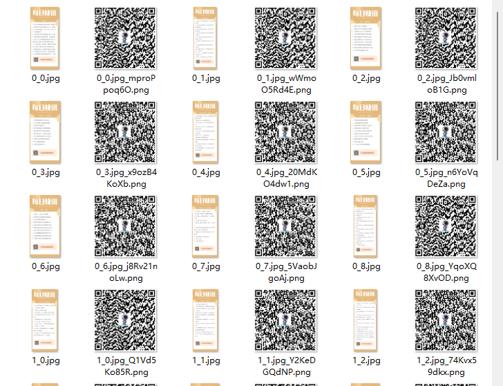

# DrawNewsReport
 爬取新闻，生成海报

使用FastAPI开发接口，方便提供三方语言（php/java/javascript等等）调用。

## 接口

①根据分类和平台获取最新新闻，并返回海报

**接口地址**：/news/poster/{category}/{platform}

**请求协议**：get

**响应内容**：图片

②根据分类和平台获取最新新闻，并返回文字

**接口地址**：/news/text/{category}/{platform}

**请求协议**：get

**响应内容**：
```json
{
    "category_name": "开发",
    "platform_name": "博客园 ‧ 48小时阅读排行",
    "url": "LBwdGgdPxq",
    "news": [
        "内存泄漏-原因、避免和定位",
        "深入浅出 CSS 动画",
        "面试官问，Redis 是单线程还是多线程?我懵了",
        "[WPF] 用 Effect 实现线条光影效果",
        "纯手撸WinForm的Alert提示弹出框",
        "MASA Framework - EventBus设计",
        "面渣逆袭：Java并发六十问，快来看看你会多少道！",
        "程序员如何让自己的技术能力突飞猛进？",
        "Redis 初见",
        "品味Spring Cache设计之美",
        "站在面试官角度，看求职与内卷",
        "Spring Boot Admin，贼好使！",
        "HttpServer: 基于IOCP模型且集成Openssl的轻量级高性能web服务器",
        "我选择了MySQL和SpringData JPA",
        "使用.NET 6开发TodoList应用(27)——实现API的Swagger文档化"
    ],
    "poster": "/news/poster/5/6"
}
```

## 演示图：



## About


